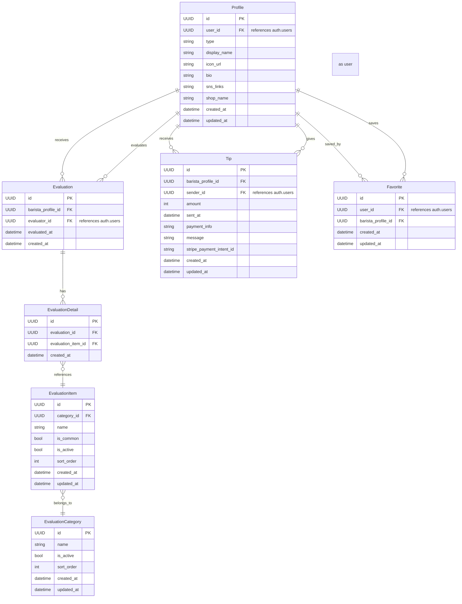

# ☕️ bra-B (ブラービ)

バリスタ個人がファンを獲得し、客観的評価とチップを受け取れるサービスです。

## 🚀 サービスの目的・特徴

- バリスタ個人のプロフェッショナルな価値を可視化し、ファンを作れるようにする
- カスタマーが 10 秒以内の手軽な評価でバリスタを応援できる
- バリスタは評価とチップにより自己ブランディングと金銭的メリットを得られる

## 🗂 技術スタック・アーキテクチャ

| 項目           | 技術選定              |
| -------------- | --------------------- |
| フレームワーク | Next.js (App Router)  |
| バックエンド   | API Routes (Next.js)  |
| フロントエンド | React                 |
| データベース   | Supabase (PostgreSQL) |
| 認証           | Supabase Auth         |
| ストレージ     | Supabase Storage      |
| デプロイ       | Vercel                |

## 🗃 データモデル（ER 図）



## ✅ 評価システム設計

- 数値評価・自由記述はなし
- カテゴリ＋タグ選択のシンプルな評価（10 秒以内で完結）
- 自由記述はチップ送信時のみ可能

### 📌 評価カテゴリ・評価タグ

| カテゴリ     | 評価タグ                                                                                         |
| ------------ | ------------------------------------------------------------------------------------------------ |
| 接客         | 笑顔が素敵, 気遣いがある, 丁寧な接客, 説明がわかりやすい, 会話が心地よい                         |
| ドリンク品質 | ラテアートが美しい, 味が素晴らしい, 温度が適切, 品質が安定している, ドリンクへのこだわりを感じる |
| サービス     | 提供がスピーディー, 注文がスムーズ, 無駄な動きがない, 丁寧な作業                                 |

| 共通タグ（任意選択）                               |
| -------------------------------------------------- |
| またお願いしたい, プロフェッショナル, 親しみやすい |

## 🔑 認証

- Supabase Auth を使用
- 以下の認証方法を提供:
  - マジックリンク
  - Google アカウント連携

## 🛠 API 設計

- Next.js App Router の API Routes を使用
- Supabase クライアントを利用してデータ操作を行う

## 📦 データストレージ

- Supabase Storage を使用してユーザープロフィール画像などを管理

## セットアップ

```bash
# 依存関係のインストール
pnpm install

# 開発環境の起動
pnpm dev
```

## 特徴

- Next.js App Router によるサーバーコンポーネントの活用
- Supabase による認証・データベース・ストレージの統合管理
- TypeScript による型安全性の確保
- レスポンシブデザインによるマルチデバイス対応
