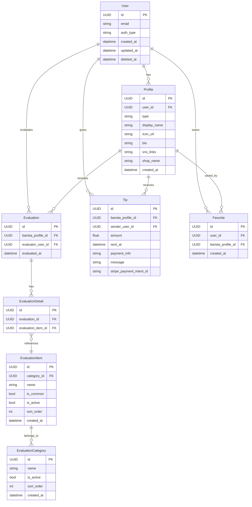

# ☕️ bra-B (ブラービ)

バリスタ個人がファンを獲得し、客観的評価とチップを受け取れるサービスです。

## 🚀 サービスの目的・特徴

- バリスタ個人のプロフェッショナルな価値を可視化し、ファンを作れるようにする
- カスタマーが 10 秒以内の手軽な評価でバリスタを応援できる
- バリスタは評価とチップにより自己ブランディングと金銭的メリットを得られる

## 🗂 技術スタック・アーキテクチャ

| 項目                       | 技術選定                |
| -------------------------- | ----------------------- |
| バックエンド               | Golang                  |
| フロントエンド             | React                   |
| インフラ（サーバレス環境） | AWS Lambda              |
| データベース               | AWS RDS PostgreSQL      |
| ORM                        | GORM                    |
| CDN・ドメイン管理          | AWS CloudFront・Route53 |
| SSL 証明書                 | AWS ACM                 |
| インフラ構成管理           | Terraform               |

## 🔨 設計方針

- ドメイン駆動設計（DDD）＋ レイヤードアーキテクチャを採用
- PostgreSQL を用いた柔軟かつ効率的なデータ設計
- Infrastructure as Code (Terraform) によるインフラ管理

## 🗃 データモデル（ER 図）



## 📚 データ構造 (GORM モデル)

<details><summary>展開して表示（GORMモデルの詳細）</summary>

```go
type User struct {
	ID        string         `gorm:"type:uuid;primaryKey;default:gen_random_uuid()"`
	Email     string         `gorm:"uniqueIndex;not null"`
	AuthType  string         `gorm:"not null"`
	CreatedAt time.Time
	UpdatedAt time.Time
	DeletedAt gorm.DeletedAt `gorm:"index"`
	Profile   Profile
}

type Profile struct {
	ID          string    `gorm:"type:uuid;primaryKey;default:gen_random_uuid()"`
	UserID      string    `gorm:"type:uuid;uniqueIndex;not null"`
	Type        string    `gorm:"type:varchar(20);not null"`
	DisplayName string    `gorm:"type:varchar(100);not null"`
	IconURL     string    `gorm:"type:text"`
	Bio         string    `gorm:"type:text"`
	SNSLinks    string    `gorm:"type:text"`
	ShopName    string    `gorm:"type:varchar(100)"`
	CreatedAt   time.Time
	User        User      `gorm:"foreignKey:UserID"`
}

type Evaluation struct {
	ID               string             `gorm:"type:uuid;primaryKey;default:gen_random_uuid()"`
	BaristaProfileID string             `gorm:"type:uuid;index;not null"`
	EvaluatorUserID  *string            `gorm:"type:uuid;index"`
	EvaluatedAt      time.Time          `gorm:"autoCreateTime"`
	EvaluationDetails []EvaluationDetail `gorm:"foreignKey:EvaluationID"`
	BaristaProfile   Profile            `gorm:"foreignKey:BaristaProfileID"`
	EvaluatorUser    User               `gorm:"foreignKey:EvaluatorUserID"`
}

type EvaluationCategory struct {
	ID              string `gorm:"type:uuid;primaryKey;default:gen_random_uuid()"`
	Name            string `gorm:"not null"`
	SortOrder       int
	IsActive        bool      `gorm:"default:true"`
	CreatedAt       time.Time
	EvaluationItems []EvaluationItem `gorm:"foreignKey:CategoryID"`
}

type EvaluationItem struct {
	ID          string `gorm:"type:uuid;primaryKey;default:gen_random_uuid()"`
	CategoryID  *string `gorm:"type:uuid;index"`
	Name        string `gorm:"not null"`
	IsCommon    bool   `gorm:"default:false"`
	IsActive    bool   `gorm:"default:true"`
	SortOrder   int
	CreatedAt   time.Time
}

type EvaluationDetail struct {
	ID               string `gorm:"type:uuid;primaryKey;default:gen_random_uuid()"`
	EvaluationID     string `gorm:"type:uuid;index;not null"`
	EvaluationItemID string `gorm:"type:uuid;index;not null"`
}

type Tip struct {
	ID                    string         `gorm:"type:uuid;primaryKey;default:gen_random_uuid()"`
	BaristaProfileID      string         `gorm:"type:uuid;index;not null"`
	SenderUserID          string         `gorm:"type:uuid;index"`
	Amount                float64        `gorm:"not null"`
	Message               string         `gorm:"type:text"`
	StripePaymentIntentID string         `gorm:"type:varchar(100);not null;uniqueIndex"`
	SentAt                time.Time
	BaristaProfile        Profile        `gorm:"foreignKey:BaristaProfileID"`
	SenderUser            User           `gorm:"foreignKey:SenderUserID"`
}

type Favorite struct {
	ID               string    `gorm:"type:uuid;primaryKey;default:gen_random_uuid()"`
	UserID           string    `gorm:"type:uuid;index;not null"`
	BaristaProfileID string    `gorm:"type:uuid;index;not null"`
	CreatedAt        time.Time
	User             User      `gorm:"foreignKey:UserID"`
	BaristaProfile   Profile   `gorm:"foreignKey:BaristaProfileID"`
}
```

</details>

## ✅ 評価システム設計

- 数値評価・自由記述はなし
- カテゴリ＋タグ選択のシンプルな評価（10 秒以内で完結）
- 自由記述はチップ送信時のみ可能

### 📌 評価カテゴリ・評価タグ

| カテゴリ     | 評価タグ                                                                                         |
| ------------ | ------------------------------------------------------------------------------------------------ |
| 接客         | 笑顔が素敵, 気遣いがある, 丁寧な接客, 説明がわかりやすい, 会話が心地よい                         |
| ドリンク品質 | ラテアートが美しい, 味が素晴らしい, 温度が適切, 品質が安定している, ドリンクへのこだわりを感じる |
| サービス     | 提供がスピーディー, 注文がスムーズ, 無駄な動きがない, 丁寧な作業                                 |

| 共通タグ（任意選択）                               |
| -------------------------------------------------- |
| またお願いしたい, プロフェッショナル, 親しみやすい |

## 🛠 バックエンド API 設計方針

バックエンド（Golang）とフロントエンド（TypeScript）の間でリクエスト・レスポンスの型を手軽かつ明快に共有するために、以下の方針を採用します。

### 📌 型定義の管理方法

- 型定義はフロントエンド（TypeScript 側）を起点とする
- Golang 側は TypeScript 側で定義された型に合わせて構造体を作成する
- OpenAPI などの重い仕組みは採用しない（管理が複雑になるため）

理由:

- シンプルで管理が容易
- フロントエンドの型定義がそのまま API 仕様書になる
- 開発初期に最適（変更にも強い）

## 🚦 バックエンドで実装が必要なエンドポイント一覧

### 🔐 認証・ユーザー関連

| Method | Endpoint         | 説明                         |
| ------ | ---------------- | ---------------------------- |
| POST   | /auth/magic-link | メールに MagicLink を送信    |
| POST   | /auth/google     | Google OAuth 認証            |
| GET    | /user/me         | ログイン中ユーザー情報の取得 |

### 👤 バリスタプロフィール関連

| Method | Endpoint                          | 説明                         |
| ------ | --------------------------------- | ---------------------------- |
| POST   | /baristas                         | バリスタプロフィールの作成   |
| PUT    | /baristas/{baristaId}             | バリスタプロフィールの更新   |
| GET    | /baristas/{baristaId}             | バリスタプロフィールの取得   |
| GET    | /baristas/{baristaId}/evaluations | バリスタ視点で評価一覧を取得 |

### 📝 評価関連

| Method | Endpoint               | 説明                         |
| ------ | ---------------------- | ---------------------------- |
| GET    | /evaluation/categories | 評価カテゴリ・タグ一覧の取得 |
| POST   | /evaluations           | カスタマーがバリスタを評価   |

### 💰 チップ関連

| Method | Endpoint                   | 説明                                       |
| ------ | -------------------------- | ------------------------------------------ |
| POST   | /tips                      | チップ送信 (Stripe の決済 IntentID を返す) |
| GET    | /baristas/{baristaId}/tips | バリスタが受け取ったチップ一覧を取得       |

### 🔖 お気に入り関連

| Method | Endpoint               | 説明                             |
| ------ | ---------------------- | -------------------------------- |
| POST   | /favorites             | お気に入りバリスタを追加する     |
| DELETE | /favorites/{baristaId} | お気に入りバリスタを削除する     |
| GET    | /favorites             | ログインユーザーのお気に入り一覧 |

## 📝 型定義の具体例（TypeScript）

実際の型定義例は以下の通りです。

<details> <summary>型定義（展開して表示）</summary>

```typescript
// 認証リクエスト（MagicLink）
type AuthRequest = {
  email: string;
};

type AuthResponse = {
  token: string;
};

// バリスタプロフィール作成・更新リクエスト
type BaristaProfileRequest = {
  displayName: string;
  iconUrl?: string;
  bio?: string;
  snsLinks?: string[];
  shopName?: string;
};

// 評価カテゴリ・タグの取得レスポンス
type EvaluationCategory = {
  id: string;
  name: string;
  tags: {
    id: string;
    name: string;
  }[];
};

type GetEvaluationCategoriesResponse = {
  categories: EvaluationCategory[];
  commonTags: { id: string; name: string }[];
};

// バリスタ評価リクエスト
type EvaluateBaristaRequest = {
  baristaId: string;
  categoryId: string;
  selectedTagIds: string[];
};

// チップ送信リクエスト（Stripe決済対応）
type SendTipRequest = {
  baristaId: string;
  amount: number;
  message?: string; // 任意の自由記述コメント
};

// チップ送信レスポンス（Stripe決済IntentIDを返却）
type SendTipResponse = {
  paymentIntentId: string;
};

// お気に入り追加リクエスト
type AddFavoriteRequest = {
  baristaId: string;
};

// お気に入り一覧レスポンス
type FavoriteListResponse = {
  favorites: BaristaProfileResponse[];
};
```

</details>

## 🏗 インフラ構成管理 (Terraform)

本プロジェクトではインフラ構成の管理と自動化に Terraform を使用しています。AWS 上に以下のリソースをコード管理しています：

- **API Gateway**: HTTP リクエストの受付と Lambda へのルーティング
- **Lambda 関数**: Go バックエンドの実行環境
- **RDS PostgreSQL**: データベース
- **VPC**: セキュアなネットワーク環境
- **CloudWatch**: ログ管理とモニタリング

### 📁 ディレクトリ構成

```
terraform/                # Terraformコード
├── modules/              # 再利用可能なモジュール
│   ├── vpc/              # ネットワーク関連
│   ├── database/         # RDS PostgreSQL
│   ├── lambda/           # Lambda関数
│   └── api_gateway/      # API Gateway
├── environments/         # 環境別設定
│   ├── dev/              # 開発環境
│   └── prod/             # 本番環境
└── README.md             # 詳細な使用方法
```

### 🚀 デプロイ方法

プロジェクトのデプロイは以下のコマンドで実行できます：

```bash
# 開発環境へのデプロイ
./scripts/deploy.sh dev

# 本番環境へのデプロイ
./scripts/deploy.sh prod
```

詳細な Terraform の使用方法は [terraform/README.md](./terraform/README.md) を参照してください。
