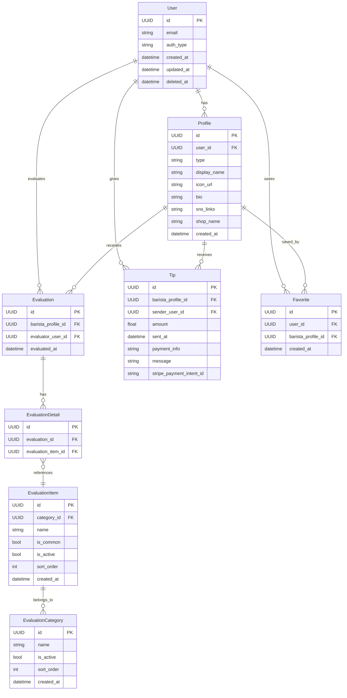

# ☕️ bra-B (ブラービ)

バリスタ個人がファンを獲得し、客観的評価とチップを受け取れるサービスです。

## 🚀 サービスの目的・特徴

- バリスタ個人のプロフェッショナルな価値を可視化し、ファンを作れるようにする
- カスタマーが 10 秒以内の手軽な評価でバリスタを応援できる
- バリスタは評価とチップにより自己ブランディングと金銭的メリットを得られる

## 🗂 技術スタック・アーキテクチャ

| 項目                       | 技術選定           |
| -------------------------- | ------------------ |
| バックエンド               | TypeScript (Hono)  |
| フロントエンド             | React              |
| インフラ（サーバレス環境） | Cloudflare Workers |
| データベース               | Cloudflare D1      |
| ORM                        | Drizzle            |
| CDN                        | Cloudflare Pages   |

## 🔨 設計方針

- ドメイン駆動設計（DDD）＋ レイヤードアーキテクチャを採用

## 🗃 データモデル（ER 図）



## ✅ 評価システム設計

- 数値評価・自由記述はなし
- カテゴリ＋タグ選択のシンプルな評価（10 秒以内で完結）
- 自由記述はチップ送信時のみ可能

### 📌 評価カテゴリ・評価タグ

| カテゴリ     | 評価タグ                                                                                         |
| ------------ | ------------------------------------------------------------------------------------------------ |
| 接客         | 笑顔が素敵, 気遣いがある, 丁寧な接客, 説明がわかりやすい, 会話が心地よい                         |
| ドリンク品質 | ラテアートが美しい, 味が素晴らしい, 温度が適切, 品質が安定している, ドリンクへのこだわりを感じる |
| サービス     | 提供がスピーディー, 注文がスムーズ, 無駄な動きがない, 丁寧な作業                                 |

| 共通タグ（任意選択）                               |
| -------------------------------------------------- |
| またお願いしたい, プロフェッショナル, 親しみやすい |

## 🔑 認証

- BETTER-AUTH (https://www.better-auth.com/docs/introduction) を使用する
- 以下の認証方法を提供する
  - マジックリンクでの登録&ログイン
  - Google アカウントでの登録&ログイン

## 🛠 バックエンド API 設計方針

バックエンド（Golang）とフロントエンド（TypeScript）の間でリクエスト・レスポンスの型を手軽かつ明快に共有するために、以下の方針を採用します。

### 📌 型定義の管理方法

- 型定義は Hono Client を利用して、バックエンドとフロントエンドの型定義を共有する

## 🚦 バックエンドで実装が必要なエンドポイント一覧

### 🔐 認証・ユーザー関連

| Method | Endpoint         | 説明                         |
| ------ | ---------------- | ---------------------------- |
| POST   | /auth/magic-link | メールに MagicLink を送信    |
| POST   | /auth/google     | Google OAuth 認証            |
| GET    | /user/me         | ログイン中ユーザー情報の取得 |

### 👤 バリスタプロフィール関連

| Method | Endpoint                          | 説明                         |
| ------ | --------------------------------- | ---------------------------- |
| POST   | /baristas                         | バリスタプロフィールの作成   |
| PUT    | /baristas/{baristaId}             | バリスタプロフィールの更新   |
| GET    | /baristas/{baristaId}             | バリスタプロフィールの取得   |
| GET    | /baristas/{baristaId}/evaluations | バリスタ視点で評価一覧を取得 |

### 📝 評価関連

| Method | Endpoint               | 説明                         |
| ------ | ---------------------- | ---------------------------- |
| GET    | /evaluation/categories | 評価カテゴリ・タグ一覧の取得 |
| POST   | /evaluations           | カスタマーがバリスタを評価   |

### 💰 チップ関連

| Method | Endpoint                   | 説明                                       |
| ------ | -------------------------- | ------------------------------------------ |
| POST   | /tips                      | チップ送信 (Stripe の決済 IntentID を返す) |
| GET    | /baristas/{baristaId}/tips | バリスタが受け取ったチップ一覧を取得       |

### 🔖 お気に入り関連

| Method | Endpoint               | 説明                             |
| ------ | ---------------------- | -------------------------------- |
| POST   | /favorites             | お気に入りバリスタを追加する     |
| DELETE | /favorites/{baristaId} | お気に入りバリスタを削除する     |
| GET    | /favorites             | ログインユーザーのお気に入り一覧 |

## 📝 型定義の具体例（TypeScript）

実際の型定義例は以下の通りです。

<details> <summary>型定義（展開して表示）</summary>

```typescript
// 認証リクエスト（MagicLink）
type AuthRequest = {
  email: string;
};

type AuthResponse = {
  token: string;
};

// バリスタプロフィール作成・更新リクエスト
type BaristaProfileRequest = {
  displayName: string;
  iconUrl?: string;
  bio?: string;
  snsLinks?: string[];
  shopName?: string;
};

// 評価カテゴリ・タグの取得レスポンス
type EvaluationCategory = {
  id: string;
  name: string;
  tags: {
    id: string;
    name: string;
  }[];
};

type GetEvaluationCategoriesResponse = {
  categories: EvaluationCategory[];
  commonTags: { id: string; name: string }[];
};

// バリスタ評価リクエスト
type EvaluateBaristaRequest = {
  baristaId: string;
  categoryId: string;
  selectedTagIds: string[];
};

// チップ送信リクエスト（Stripe決済対応）
type SendTipRequest = {
  baristaId: string;
  amount: number;
  message?: string; // 任意の自由記述コメント
};

// チップ送信レスポンス（Stripe決済IntentIDを返却）
type SendTipResponse = {
  paymentIntentId: string;
};

// お気に入り追加リクエスト
type AddFavoriteRequest = {
  baristaId: string;
};

// お気に入り一覧レスポンス
type FavoriteListResponse = {
  favorites: BaristaProfileResponse[];
};
```

</details>
