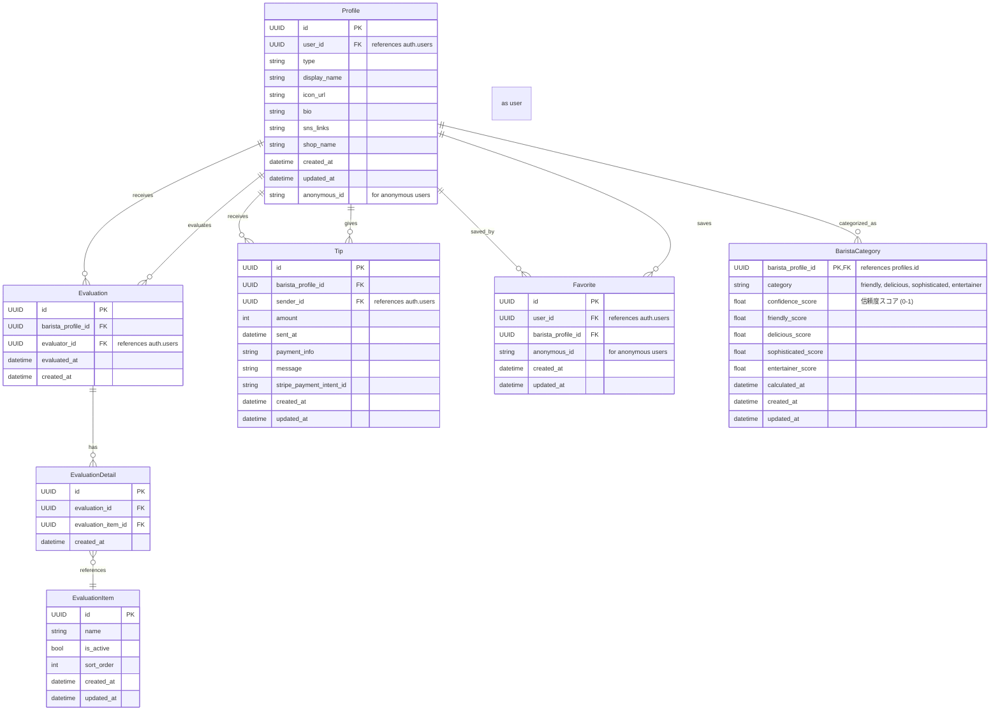

bra-B (ブラービ)

「お店」ではなく、「バリスタ」に焦点を当てたバリスタ評価サービスです。
ユーザーが「バリスタ」起点でコーヒーを飲みに行くようなカフェ体験を提供します。

## 🚀 サービスの目的・特徴

- カスタマーは気になるバリスタ、お気に入りのバリスタを見つけられる
- バリスタ個人のプロフェッショナルな価値を可視化し、ファンを作れるようにする
- カスタマーが 10 秒以内の手軽な評価でバリスタを応援できる
- バリスタは評価とチップにより自己ブランディングと金銭的メリットを得られる

## 🗂 技術スタック・アーキテクチャ

| 項目           | 技術選定                         |
| -------------- | -------------------------------- |
| フレームワーク | Next.js (App Router)             |
| バックエンド   | API Routes (Next.js)             |
| フロントエンド | React                            |
| データベース   | Supabase (PostgreSQL)            |
| 認証           | Supabase Auth                    |
| ストレージ     | Supabase Storage                 |
| サーバーレス関数 | Supabase Edge Functions (Deno)   |
| デプロイ       | Vercel                           |

## 🗃 データモデル（ER 図）



## ✅ 評価システム設計

- 数値評価・自由記述はなし
- 評価項目の複数選択によるシンプルな評価（10 秒以内で完結）
- 自由記述はチップ送信時のみ可能

### 📌 評価項目

バリスタは以下4つのカテゴリのいずれかに属するように評価されます：
- 親しみやすい
- 美味しい一杯を届ける
- 洗練されたサービス
- エンターテイナー

| 評価項目                  | 関連するカテゴリ        |
|--------------------------|------------------------|
| 笑顔が素敵                | フレンドリー            |
| 話しやすい                | フレンドリー            |
| 親身になってくれる         | フレンドリー            |
| 常連を覚えている           | フレンドリー            |
| 明るい                   | フレンドリー            |
| コーヒーの知識が豊富      | 美味しい一杯を届ける     |
| 味が素晴らしい            | 美味しい一杯を届ける     |
| 豆の説明が的確            | 美味しい一杯を届ける     |
| 淹れ方が丁寧              | 美味しい一杯を届ける     |
| ラテアートが美しい        | 美味しい一杯を届ける     |
| 身だしなみが清潔          | 洗練されたサービス      |
| 丁寧な接客                | 洗練されたサービス      |
| 店内の清潔さ              | 洗練されたサービス      |
| テキパキした動き          | 洗練されたサービス      |
| 声が聞き取りやすい        | 洗練されたサービス      |
| 話が面白い                | エンターテイナー        |
| 個性的                   | エンターテイナー        |
| コーヒーへの熱意がある     | エンターテイナー        |
| 記憶に残る体験            | エンターテイナー        |
| SNSが魅力的               | エンターテイナー        |

### 🧮 カテゴリ計算ロジック

バリスタのカテゴリは、Supabase Edge Functionによって自動計算されます。計算ロジックの概要：

1. ユーザーからの評価項目選択データを収集
2. 各カテゴリに関連する評価項目の出現頻度を集計
3. 評価数を考慮して正規化されたスコアを各カテゴリに割り当て
4. 最も高いスコアのカテゴリをバリスタのメインカテゴリとして設定
5. 信頼度スコア（confidence_score）は、トップカテゴリのスコアと他のカテゴリのスコア比較から算出

バリスタのスコアは、プロフィールページで視覚的に表示され、カテゴリごとの強みが一目でわかるようになっています。

## 🔑 認証

- Supabase Auth を使用
- 以下の認証方法を提供:
  - マジックリンク
  - Google アカウント連携

### 匿名ユーザーの認証フロー

ブラービでは、ログインしなくても一部機能を利用できる匿名ユーザーシステムを実装しています。これにより、ユーザーはアカウント登録の手間なく、バリスタの閲覧やお気に入り登録などの基本的な機能を利用できます。

#### 匿名ユーザーの仕組み

1. **匿名IDの生成**
   - ユーザーが初めてサイトにアクセスすると、middleware.ts が実行され、uuid v4 形式の匿名ID が生成されます
   - この匿名ID は Cookie に `anonymous_id` として保存され、30日間有効です
   - Cookie は以下の属性で設定されます:
     ```javascript
     {
       maxAge: 60 * 60 * 24 * 30, // 30日間
       path: "/",
       httpOnly: true,
       secure: process.env.NODE_ENV === "production",
       sameSite: "lax",
     }
     ```

2. **匿名プロファイルの作成**
   - 匿名ID生成と同時に、profiles テーブルに匿名ユーザープロファイルが作成されます
   - プロファイルには以下のデータが含まれます:
     ```javascript
     {
       id: anonymousId,        // UUID 形式の匿名ID
       anonymous_id: anonymousId, // 同じ値を重複保存（検索用）
       user_id: null,          // 認証ユーザーの場合は auth.users の ID が入る
       type: "anonymous",      // anonymous, user, barista のいずれか
       display_name: `匿名ユーザー_${anonymousId.substring(0, 8)}`,
       icon_url: "",
       bio: "",
     }
     ```

3. **セッション管理**
   - 匿名ユーザーは Supabase Auth のセッションを持ちません
   - すべてのリクエストで Cookie から `anonymous_id` を取得し、データベースクエリに使用します

#### 匿名ユーザーの権限と制限

| 機能               | 匿名ユーザー | 認証ユーザー |
|--------------------|:------------:|:------------:|
| バリスタ閲覧       | ✅            | ✅            |
| お気に入り登録     | ✅            | ✅            |
| バリスタ評価       | ❌            | ✅            |
| チップ送信         | ❌            | ✅            |
| プロフィール編集   | ❌            | ✅            |
| バリスタ登録       | ❌            | ✅            |

#### 認証ユーザーへの移行フロー

匿名ユーザーがアカウント登録すると、以下のデータ移行プロセスが実行されます：

1. ユーザーがログイン/登録すると、認証情報と匿名IDが紐付けられます
2. `migrateAnonymousFavorites` 関数が実行され、匿名ユーザーのお気に入り情報が認証ユーザーに移行されます
3. 以降のリクエストでは、認証セッションが優先され、匿名IDは参照されなくなります

```javascript
// 匿名ユーザーのお気に入りを認証ユーザーに移行する関数
export async function migrateAnonymousFavorites(userId: string, anonymousId: string) {
  const supabase = await createClient();

  // 匿名ユーザーのお気に入り取得
  const { data: anonymousFavorites } = await supabase
    .from("favorites")
    .select("*")
    .eq("anonymous_id", anonymousId);

  if (anonymousFavorites?.length) {
    // 認証ユーザー用のお気に入りデータに変換
    const migratedFavorites = anonymousFavorites.map((fav) => ({
      barista_profile_id: fav.barista_profile_id,
      user_id: userId,
      anonymous_id: anonymousId, // 追跡用に保持
    }));

    // 一括挿入（競合はスキップ）
    await supabase.from("favorites").upsert(migratedFavorites, {
      onConflict: "barista_profile_id,user_id",
      ignoreDuplicates: true,
    });
  }
}
```

#### 技術的実装ポイント

1. **ミドルウェアの設定**
   - API ルートを含むすべてのパスでミドルウェアが実行されるよう設定
   - matcher 設定: `"/((?!_next|favicon.ico|static).*)"`

2. **重複登録エラー対策**
   - お気に入り登録時の制約違反エラーを適切に処理
   - エラーコード `23505`（一意制約違反）や `42P10`（ON CONFLICT 指定不一致）をハンドリング

3. **キャッシュ問題の対策**
   - フロントエンド側: リクエストにタイムスタンプパラメータ追加
   - バックエンド側: Cache-Control ヘッダー設定（`no-store, no-cache, must-revalidate`）

## 🛠 API 設計

- Next.js App Router の API Routes を使用
- Supabase クライアントを利用してデータ操作を行う

## 📦 データストレージ

- Supabase Storage を使用してユーザープロフィール画像などを管理

## 📡 Supabase Edge Functions

ブラービでは、バリスタの評価カテゴリ計算にSupabase Edge Functions（Deno）を使用しています。これにより、複雑な計算ロジックをTypeScriptで実装し、柔軟に調整できます。

### 📋 バリスタカテゴリ計算

バリスタプロフィールに表示されるカテゴリ（フレンドリー、美味しい一杯を届ける、洗練されたサービス、エンターテイナー）は、ユーザーからの評価に基づき自動計算されます。計算ロジックはSupabase Edge Function `update-barista-category`で実装されています。

#### Edge Functionの構造

```
supabase/
  └── functions/
      └── update-barista-category/
          ├── index.ts       # メイン実装
          └── deno.json      # Deno設定
```

#### 主要機能

- 評価データに基づき、各カテゴリのスコアを計算
- 最も高いスコアのカテゴリをバリスタのメインカテゴリとして設定
- 各カテゴリの詳細スコアも保存し、プロフィールページに表示

#### 呼び出しタイミング

- 新しい評価が追加されたとき
- 評価が更新されたとき
- 管理者が手動で再計算を要求したとき

### 🛠️ Edge Functionsの開発・デプロイ方法

#### ローカル開発環境での実行

```bash
# Supabase CLI で Functions を起動
pnpm supabase functions serve

# 別ターミナルでテスト（例）
curl -i --location --request POST 'http://localhost:54321/functions/v1/update-barista-category' \
  --header 'Authorization: Bearer YOUR-ANON-KEY' \
  --header 'Content-Type: application/json' \
  --data '{"barista_id": "BARISTA-UUID"}'
```

#### デプロイ方法

```bash
# 全ての関数をデプロイ
pnpm supabase functions deploy

# 特定の関数のみデプロイ
pnpm supabase functions deploy update-barista-category
```

#### デバッグ方法

```bash
# デバッグ情報を表示
pnpm supabase functions deploy update-barista-category --debug

# ログを確認
pnpm supabase functions logs update-barista-category
```

## セットアップ

```bash
# 依存関係のインストール
pnpm install

# 開発環境の起動
pnpm dev
```

## 特徴

- Next.js App Router によるサーバーコンポーネントの活用
- Supabase による認証・データベース・ストレージの統合管理
- TypeScript による型安全性の確保
- レスポンシブデザインによるマルチデバイス対応
